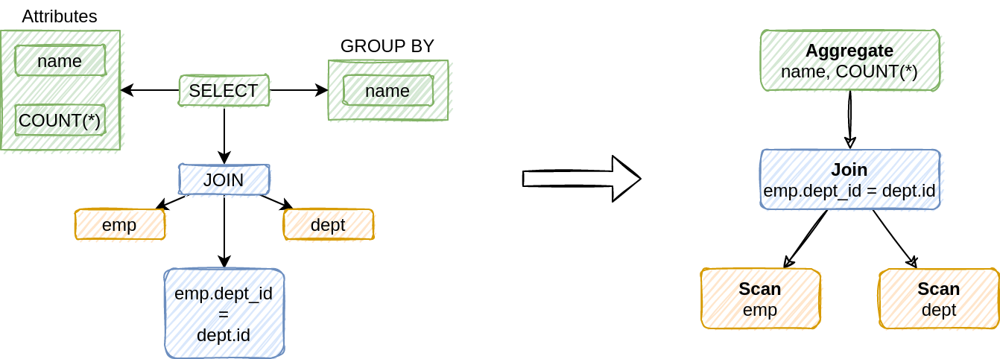
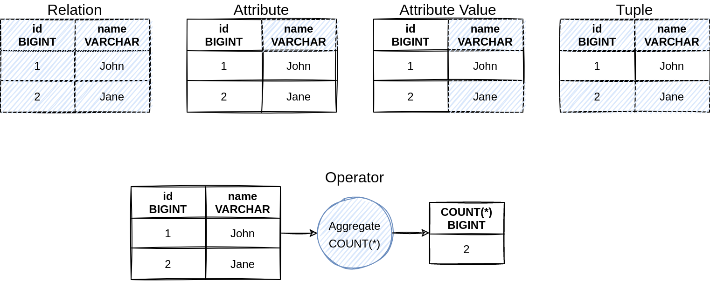
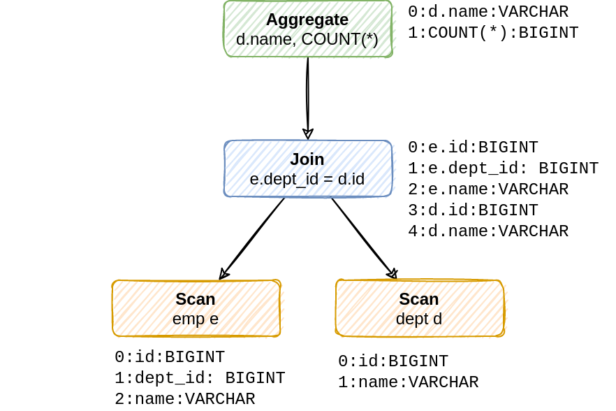
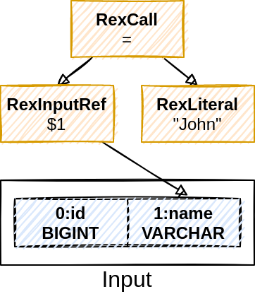
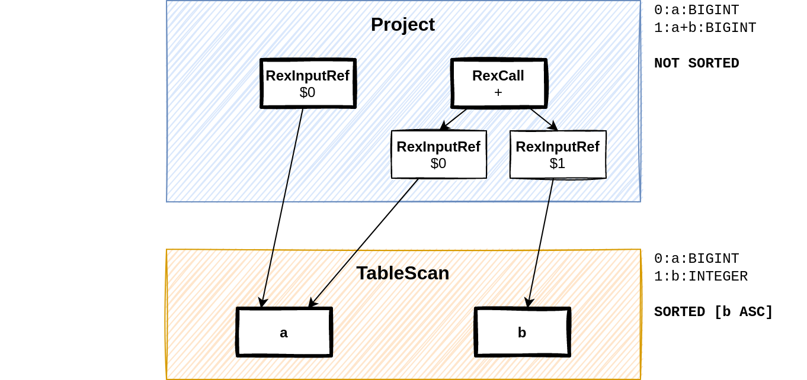
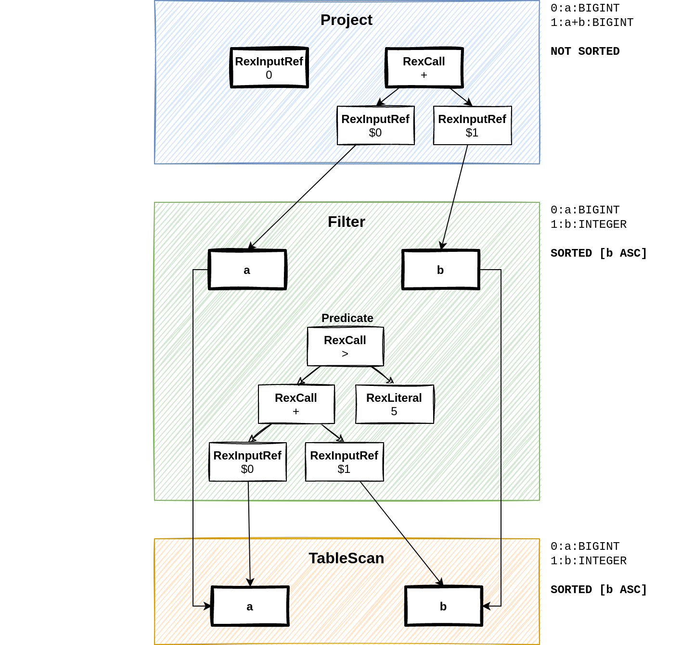
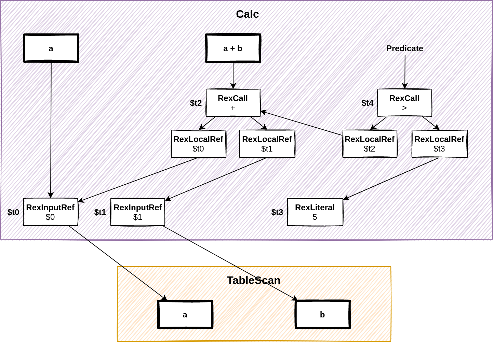
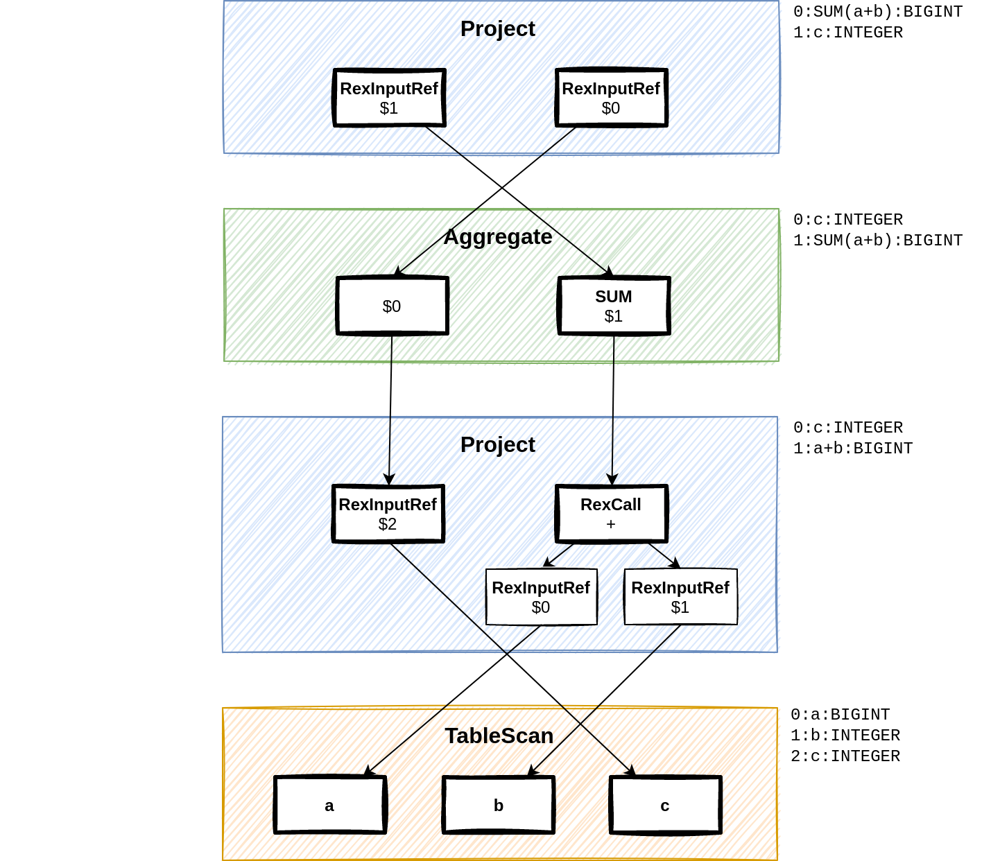
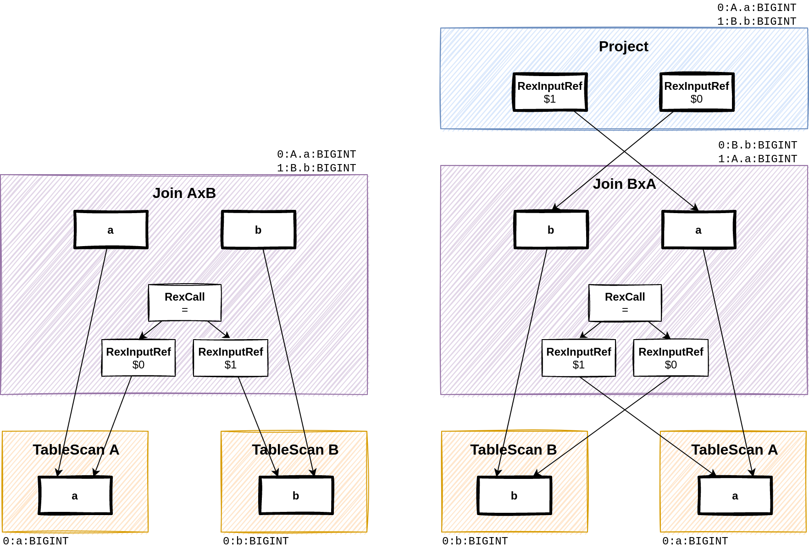

# Relational Operators in Apache Calcite

## Abstract 

　사용자가 데이터베이스에 쿼리를 전달하면, 옵티마이저는 쿼리를 Intermediate Representation(IR, 중간 표현)으로
변환하고 최적화 방안에 따라 다양한 변환을 적용하게 된다.  
　Apahce Calcite에서는 relational operator를 IR로 사용하기에, relational operator에 관하여 정리한다.

---

## Intermediate Representation

### Syntax Tree
 

 
　쿼리 최적화는 syntax tree로 변환된 쿼리를 파싱하는 것으로 시작된다.
여기서 syntax tree란 쿼리의 구문 구조를 정의한 것이라 볼 수 있다. 데이터베이스들은 파서를 가지고 있기 때문에, syntax tree는 모든 데이터베이스에서 사용할 수 있으며, 따라서 데이터베이스들의 IR로 적합한 후보로 볼 수 있다.
  
하지만 syntax tree를 IR로 쓰기에는 두 가지 큰 문제점이 존재한다

1. Anonymous Syntax Tree(AST)는 ANSI SQL syntax 때문에 매우 복잡한 구조를 가지고 있다.  
예를 들어 SELECT 노드에는 FROM, WHERE, ORDER BY, GROUP BY 등에 대한 자식노드가 있을 수 있다.
2. AST는 구문 구조를 모델링하지만 관계형 의미는 모델링 하지 않는다.  
그 말은 syntax tree에 **관계형 변환을 매핑**하는 것이 문제가 될 수 있다는 말이다. 하나의 예로 semi join은
ANSI SQL 구문으로 쉽게 표현하기 어렵다.

이런 사실들을 볼 때, syntax tree에 대한 **쿼리 최적화가 어렵고 유연하지 못하다**.
 
### Relational Tree
 
　IR의 대안으로 사용되는 것이 reltional operator tree 이다. Project, Filter, Join, Aggregate와 같은
일반적인 관계형 연산자를 정의할 수 있다.  

#### 장점

- 잘 정의된 범위와 보통 하나의 입력(Join과 Set 연산자 제외)으로 인해 쿼리가 보다 간결하게 최적화 될 수 있다.
- 연산자의 transoposition과 같은 일반적인 관계형 최적화를 극도로 단순화 시킬 수 있다 
- 구현하는 주체가 데이터베이스의 syntax rule과는 독립적으로 연산자를 모델링할 수 있는 유연성을 제공한다.

#### 단점

- syntax tree를 relational tree로 변환해야되는데, 이 과정이 단순하지 않다
- 특히 subquery 또는 공통 테이블 표현식 같은 복잡한 구문 구조의 경우 특히 복잡해진다

---

## Basics
 
　Apache Calcite는 쿼리를 syntax tree로 파싱한다. 이때 **SqlValidatorImpl**를 통해 syntax tree의 
의미검증을 수행하여 관련 데이터 유형을 해결한다. 최종적으로 **SqlToRelConverter**를 통해 syntax tree는 관계형 연산자로
변환된다. 최적화는 syntax tree가 아닌 관계형 트리에서 진행된다.

### Terminology

- Attribute
    - 이름과 데이터타입의 쌍
- Attribute value
    - 속성 이름과 속성 타입 토메인으로 부터의 값
- Tuple
    - Attribute value의 unordered set.
- Relation
    - tuple들의 set
- Relation 내의 tuple들은 같은 attribute set을 가진다
- Relational Operators
    - 0개, 1개 또는 그 이상의 입력 관계를 사용해 출력 관계를 생성하는 것

### Operators

관계 연산자 인터페이스 구현을 위한 주요 사항

1. 관계 연산자들의 트리를 만들기 위해서는 연산자들의 입력을 정의해야만 한다.
2. 관계를 형성하기 위해서는 다수의 연산자는 입력 relation의 attribute에 접근할 필요가 있다.
그러므로 입력된 attribute를 참조할 수 있는 기능이 필요하다.

Apache Calcite의 관계 연산자는 앞서 말했듯 0개 혹은 그 이상의 입력 연산자를 가지고 있으며 RelNode라는 인터페이스로 표현된다.
- TableScan
    - 0-ary operator
- Filter
    - unary operator
- Union
    - N-ary operator

모든 연산자는 RelDataType이라는 클래스를 노출하며, 이는 연산자 attribute의 정렬된 목록으로 볼 수 있다.

### Row Expressions
 
　연산자들은 tuple에 대한 다양한 변환을 나타낸다. RexNode 인터페이스는 tuple의 일부 attribute value에 
적용되며, 다른 값을 생성하는 작업에 대해 정의된다.

1. RexLiteral : 상수
2. RexInputRef : 연산자의 입력 attribute에 대한 참조
    - index로 입력 attribute에 대해 참조하며, 즉, attribute의 순서가 Apache calcite에서는 매우매우 중요하다
3. RexCall : 함수 호출

---

## Operators

### TableScan

0-ary 연산자로 어떤 데이터 입력으로부터 **tuple을 생성**하는 역할을 담당한다.
- 다양한 data source를 표현 가능하며 table, index, csv, 네트워크 커넥션까지 표현할 수 있다.
- org.apache.calcite.schema.Table 인스턴스를 포함한다
- 데이터베이스에서 반드시 Table 인스턴스를 이용 또는 포함하여 구현해야한다
- 쿼리를 처리할 때, 쿼리 내 Table 인스턴스의 정보를 참조하여 TableScan 연산자를 생성하기 때문이다.
- Table 인스턴스는 TableScan에서 attribute를 사용할 수 있도록 row type의 정보를 제공하게 된다.

### Project

Projection은 새로운 tuple을 생성하기 위한 입력 **tuple의 row 표현식을 정의**한다.
즉, 입력된 모든 tuple에 대한 하나의 **새로운 tuple을 생성**하며, 표현식은 리스트로 구성된다.
- Local index를 사용하기 때문에 attribute의 순서를 변경할 때 마다 project 연산자도 추가된다.
    - 예를들어 [a, b] attribute에 대해 select b, a from t 를 수행하게되면 
    Table Scan 후에 index를 재배치하기 위한 Projection이 추가된다.
- 이는 최적화시 사소한 재정렬을 수행하기 떄문에 쿼리 플랜을 복잡하게 만드는 요인이된다.

　Project 연산자의 물리적 구현은 **traits**의 조정이 반드시 필요하다.
예를 들어, TableScan이 [b]로 정렬된 tuple을 생성했다고 쳐도, Project 연산자가 [b] column을 projection 하지
않는다면, 정렬이 소실되버리는 현상이 발생한다.

### Filter

　Filter 연산자는 조건을 만족하는 tuple을 리턴받는다. 
 - 조건은 predicate로 row expression
 - Filter의 출력은 입력 row type과 비슷함
 - Filter의 물리적 구현은 주로 입력의 traits을 변경하지 않는다

ex) select a, a+b from t where a+b > 5

### Calc

　Calc는 특별한 연산자로 기능적으로 Project와 Filter를 조합한 것이며, 추가적으로 공통의 sub-expression 제거를 수행한다.
- 내부적으로, Calc는 모든 복합적인 row expression을 기본 표현식으로 분해한다.
- 표현식들은 목록으로 구성되며, **RexLocalRef** 노드는 sibling들을 연결하는 용도로 사용된다.
- Project는 연산자가 노출해야하는 표현식의 **인덱스 목록**이 된다.
- Filter는 필터링 되야하는 입력 tuple들에 대한 **선택적인 표현식의 인덱스**가 된다.

Apache Calcite에서는 Project와 Filter에 대한 많은 최적화 규칙을 제공한다.
하지만, Calc에 대한 최적하는 보통 제공되지 않는데, Calc는 Project와 Filter의 **규칙 논리에 대한 복제**가 발생하기 때문이다.
따라서, 이를 최적화하려면 cost-based 최적화로 Project와 Filter를 최적화하고 Calc로 대체하는 부분은 heuristic 최적화 단계에서
나눠 진행하는 방식을 택해야 한다. **다단계 최적화**에 대한 정리를 참고하자.

ex) select a, a+b from t where a+b > 5

### Aggregate

　Aggregate 연산자는 입력에 대한 aggregate 함수의 적용을 모델링한다. Group key와 aggregation 함수, 두 파트로 구성된다.

#### Group key

- 그룹핑을 위한 입력 attribute를 정의
- Group by절 입력 column 인덱스가 group key가 된다
- 예를 들어 group by a,b 에서 a,b의 index 가 0,1이라면 group key는 [0, 1]이 된다
- group by절이 없다면 group key는 비워진 채로 생성

쿼리에 Group By 절이 존재한다면, Aggergate와 별도로 하위에 Project 연산자로 이동하게 된다.
Project와 Aggregate의 분리는 최적화 규칙의 복잡성을 제어하기 위한 중요한 요소이다.

#### Aggregate Function

- 그룹핑된 그룹에 대한 계산의 목록 
- Group key 처럼 인덱스로 입력 column을 참조한다.
- Aggregate 함수는 RexNode 인터페이스를 사용하지 않는데, RexNode는 단일 tuple에서 동작하는 row expression과 달리
여러 tuple에 대해서 동작하기 때문이다.

ex) select sum(a+b), c from t group by c  
　두 개의 Project 중 최종 출력 c와 더불어 그전에 SUM을 출력하기 위한 projection을 확인하자

### Join

　Join 연산자는 두개의 입력을 받으며 Join type과 조건 두가지를 정의하며, 왼쪽 입력의 모든 column을 출력하고
오른쪽 입력의 열을 출력한다.  
 Apache Calcite에서는 **RexInputRef**의 attribute index에 의존하기 때문에, Join(A x B)와 Join(B x A)는 의미상으로 동일하지 않다.
 즉, AxB와 BxA를 연산할 때 같은 join type에도 불구하고 다른 인덱스를 사용해야 한다.

---

## Summary

　Apache Calcite는 쿼리를 syntax tree로 변환하고, 이를 다시 **관계형 연산자 트리(Relational Operator Tree)**로 변환한다.
이렇게 함으로써 내부 구조를 단순화할 수 있고 최적화 단계에 보다 적합한 구조를 취할 수 있다.  
　Calcite에는 몇 개의 일반적인 연산자가 존재한다. 먼저 Project는 입력으로 들어오는 tuple로 부터 새로운 tuple로의 변환 및 출력을 수행한다.
Filter는 입력 tuple의 조건을 통과하는 tuple을 가져오며, Calc는 Project와 Filter를 기능적인 조합으로 sub-expression들의 중복을 제거한다.
 Aggregate는 그룹핑과 그룹핑에 대한 aggregation function을 적용한다. 마지막으로 Join 연산자는 두 개의 tuple을 join type에 따라
 하나의 tuple로 형성한다.  
 　관계형 연산자의 최적화를 위한 새로운 방법은 다른 최적화를 막을 수 있기 때문에 여러가지 방법으로 도전해보아야 한다.